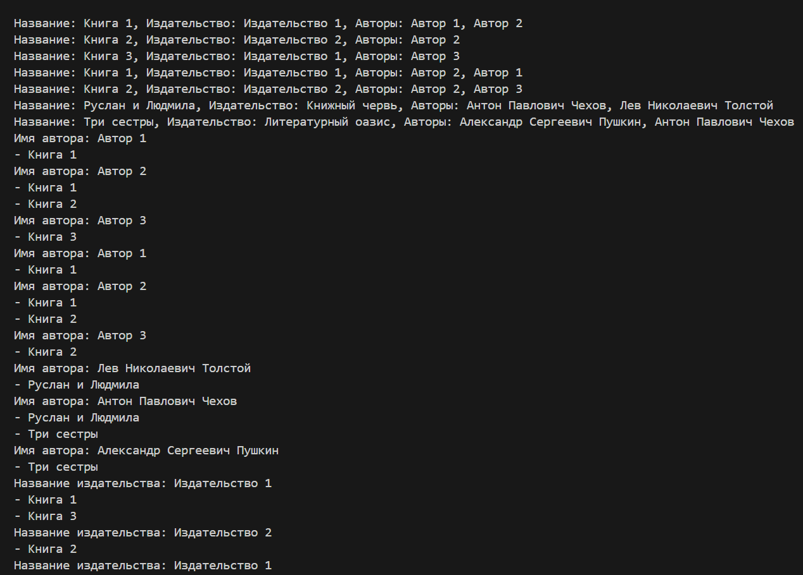

# Лабораторная работа №17
## SQLAlchemy ORM
### Сложность:Rare
Задания для самостоятельного выполнения

1. Спроектируйте БД с использованием crow’s foot notation.
2. Напишите модели данных, создайте и заполните БД с помощью SQLAlchemy.
3. Напишите запросы для выборки и анализа данных из БД.
4. Оформите отчёт в README.md. Отчёт должен содержать:
+ Условия задач
+ Описание проделанной работы
+ Скриншоты результатов
+ Ссылки на используемые материалы

#### Вариант 4
Книги. Каждая книга издаётся одним издательством, но у неё может быть несколько авторов.

```python
from sqlalchemy.ext.declarative import declarative_base
from sqlalchemy import Column, Integer, String, ForeignKey
from sqlalchemy.orm import relationship

Base = declarative_base()

class Book(Base):
    __tablename__ = 'books'
    id = Column(Integer, primary_key=True)
    title = Column(String)
    publisher_id = Column(Integer, ForeignKey('publishers.id'))
    publisher = relationship("Publisher", back_populates="books")
    authors = relationship("Author", secondary="book_authors", back_populates="books")

class Publisher(Base):
    __tablename__ = 'publishers'
    id = Column(Integer, primary_key=True)
    name = Column(String)
    books = relationship("Book", back_populates="publisher")

class Author(Base):
    __tablename__ = 'authors'
    id = Column(Integer, primary_key=True)
    name = Column(String)
    books = relationship("Book", secondary="book_authors", back_populates="authors")

class BookAuthor(Base):
    __tablename__ = 'book_authors'
    id = Column(Integer, primary_key=True)
    book_id = Column(Integer, ForeignKey('books.id'))
    author_id = Column(Integer, ForeignKey('authors.id'))

from sqlalchemy import create_engine
from sqlalchemy.orm import sessionmaker

engine = create_engine('sqlite:///books.db')
Base.metadata.create_all(engine)

Session = sessionmaker(bind=engine)
session = Session()

# Создание издательств
pub1 = Publisher(name='Книжный червь')
pub2 = Publisher(name='Литературный оазис')
session.add_all([pub1, pub2])

# Создание авторов
author1 = Author(name='Лев Николаевич Толстой')
author2 = Author(name='Антон Павлович Чехов')
author3 = Author(name='Александр Сергеевич Пушкин')
session.add_all([author1, author2, author3])

# Создание книг
book1 = Book(title='Руслан и Людмила', publisher=pub1)
book1.authors.append(author1)
book1.authors.append(author2)

book2 = Book(title='Три сестры', publisher=pub2)
book2.authors.append(author2)
book2.authors.append(author3)

session.add_all([book1, book2])
session.commit()

# Получение всех книг
books = session.query(Book).all()
for book in books:
    print(f"Название: {book.title}, Издательство: {book.publisher.name}, Авторы: {', '.join([author.name for author in book.authors])}")

# Получение всех авторов и их книг
authors = session.query(Author).all()
for author in authors:
    print(f"Имя автора: {author.name}")
    for book in author.books:
        print(f"- {book.title}")

# Получение всех издательств и их книг
publishers = session.query(Publisher).all()
for publisher in publishers:
    print(f"Название издательства: {publisher.name}")
    for book in publisher.books:
        print(f"- {book.title}")
```


<p style="text-align: center;"> Результат программы.</p>